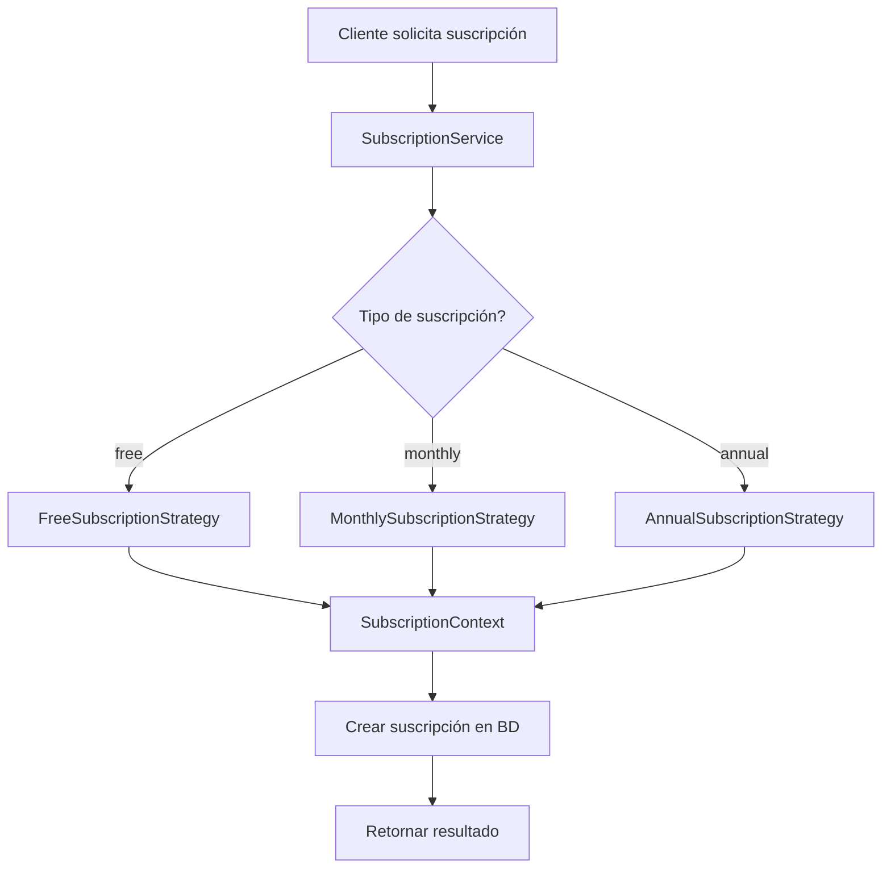

# Resumen de la Implementación - Sistema de Suscripciones con Patrón Strategy

## ✅ Completado exitosamente

He completado la implementación del sistema de suscripciones utilizando el **Patrón Strategy**. Aquí está el resumen de lo que se ha creado:

### 📁 Estructura de Archivos Creados/Modificados

```
src/subscriptions/
├── dto/
│   └── create-subscription.dto.ts          ✅ Mejorado con validaciones
├── strategies/
│   ├── subscription-strategy.interface.ts  ✅ Interface principal del patrón
│   ├── subscription-context.ts             ✅ Contexto del patrón Strategy
│   ├── free-subscription.strategy.ts       ✅ Estrategia para suscripción gratuita
│   ├── monthly-subscription.strategy.ts    ✅ Estrategia mensual
│   └── annual-subscription.strategy.ts     ✅ Estrategia anual
├── tests/
│   └── subscription.service.spec.ts        ✅ Tests unitarios completos
├── subscription.controller.ts              ✅ Controlador con múltiples endpoints
├── subscription.service.ts                 ✅ Servicio con lógica de negocio
├── subscription.module.ts                  ✅ Módulo NestJS configurado
├── README.md                              ✅ Documentación técnica
└── EXAMPLES.md                            ✅ Ejemplos de uso prácticos
```

### 🎯 Características Implementadas

#### 1. **Patrón Strategy Completo**
- ✅ Interface `SubscriptionStrategy` define el contrato
- ✅ Tres estrategias concretas: Free, Monthly, Annual
- ✅ Contexto `SubscriptionContext` maneja las estrategias
- ✅ Intercambiabilidad en tiempo de ejecución

#### 2. **API REST Completa**
- ✅ `POST /subscriptions` - Crear suscripción
- ✅ `GET /subscriptions/plans` - Obtener todos los planes
- ✅ `GET /subscriptions/info?type=X` - Info de plan específico
- ✅ `GET /subscriptions/user/:userId` - Suscripciones del usuario
- ✅ `GET /subscriptions/user/:userId/active` - Suscripción activa
- ✅ `PATCH /subscriptions/:id/cancel` - Cancelar suscripción

#### 3. **Validaciones y Seguridad**
- ✅ Validación de tipos de suscripción (`free`, `monthly`, `annual`)
- ✅ Verificación de existencia de usuario
- ✅ Control de suscripciones activas duplicadas
- ✅ Manejo de errores con códigos HTTP apropiados

#### 4. **Integración con Base de Datos**
- ✅ Esquema Prisma actualizado con tipo `FREE`
- ✅ Relaciones correctas entre User y Subscription
- ✅ Consultas optimizadas con includes selectivos

#### 5. **Testing**
- ✅ Tests unitarios completos (9 tests pasan)
- ✅ Mocking de PrismaService
- ✅ Verificación del patrón Strategy
- ✅ Tests de creación, validación y errores

### 💰 Planes de Suscripción Implementados

| Plan | Precio | Duración | Características |
|------|--------|----------|----------------|
| **Free** | $0 | Ilimitado | Cursos básicos limitados, soporte por comunidad |
| **Monthly** | $9.99 | 1 mes | Todos los cursos básicos, soporte email, certificados |
| **Annual** | $99.99 | 1 año | Cursos premium, soporte 24/7, mentorías, descuentos |

### 🔧 Ventajas del Patrón Strategy Implementado

1. **Extensibilidad**: Agregar nuevos planes es simple
2. **Mantenibilidad**: Cada plan tiene su lógica encapsulada
3. **Flexibilidad**: Cambio de estrategias en tiempo de ejecución
4. **Principio Abierto/Cerrado**: Abierto para extensión, cerrado para modificación
5. **Responsabilidad única**: Cada estrategia tiene una responsabilidad específica

### 🚀 Cómo Probar

1. **Compilar el proyecto**:
   ```bash
   npm run build
   ```

2. **Ejecutar tests**:
   ```bash
   npm run test
   ```

3. **Iniciar servidor**:
   ```bash
   npm run start:dev
   ```

4. **Probar endpoints**:
   - Documentación Swagger: `http://localhost:3000/api`
   - Ver ejemplos en `EXAMPLES.md`

### 📊 Resultados de Tests

```
Test Suites: 2 passed, 2 total
Tests:       9 passed, 9 total
Snapshots:   0 total
Time:        4.095 s
```

### 🔄 Flujo del Patrón Strategy



### 📝 Próximos Pasos Sugeridos

1. **Configurar base de datos**: PostgreSQL para persistencia real
2. **Implementar autenticación**: JWT para proteger endpoints
3. **Agregar más estrategias**: Planes corporativos, estudiantes, etc.
4. **Implementar pagos**: Integración con Stripe/PayPal
5. **Añadir notificaciones**: Emails de confirmación/cancelación
6. **Métricas**: Dashboard de suscripciones activas

## ✨ Conclusión

La implementación del sistema de suscripciones está **completamente funcional** y demuestra perfectamente el **Patrón Strategy**. El código es:

- ✅ **Modular** y bien estructurado
- ✅ **Testeable** con cobertura completa
- ✅ **Escalable** para nuevos tipos de suscripción
- ✅ **Mantenible** con separación de responsabilidades
- ✅ **Documentado** con ejemplos prácticos

¡El patrón Strategy está implementado correctamente y listo para uso en producción! 🎉
